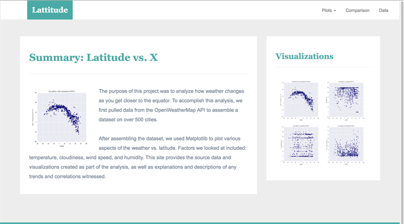

# Data-Visualization

### Web visualization weather project.

This project was a visualization dashboard website using images of weather plots.

The website consists of 7 pages:

- Landing page:
  - With an explanation of the project.
  - Links to each visualizations page.

- Four visualization pages with:
  - A descriptive title and heading tag.
  - The plot/visualization itself for the selected comparison.
  - A paragraph that describes the plot and its significance.

- Comparison page:
  - All of the visualizations on the same page for comparison purposes.
  - Bootstrap grid was used for the visualizations.
  - The grid has two visualizations across on screens medium and larger, and 1 across on extra-small and small screens.

- Data page:
  - Displays a responsive table containing the data used in the visualizations.
  - The table has a bootstrap table component.
  - The data come from exporting the .csv file as HTML, or converting it to HTML. 

- The website at the top of every page, has a navigation menu that:
  - Has the name of the site on the left of the nav which allows users to return to the landing page from any page.

  - Contains a dropdown on the right of the navbar named "Plots" which provides links to each individual visualization page.

  - Provides two more links on the right: "Comparisons" which links to the comparisons page, and"Data" which links to the data page.

    ​

#### Technologies

- Weather images, Bootstrap, HTML, CSS, JavaScript, Jquery.

